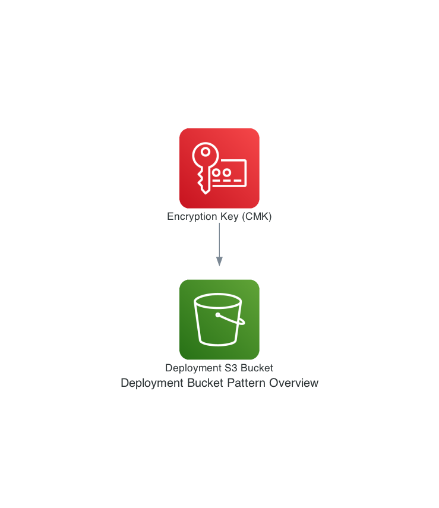

# onp.aws.bootstrap.deployment.deploymentbucket

## Metadata
| attribute               | value                                         |
| ----------------------- | --------------------------------------------- |
| pattern-id              | onp.aws.bootstrap.deployment.deploymentbucket |
| pattern-name            | deployment-bucket                             |
| pattern-version         | 1.0.0                                         |
| pattern-description     | This pattern is used as a temporary storage for the deployment material. Common use cases include storing Cloudformation stacks which are ready to be deployed and storing compressed code artifacts used for lambda based deployments.                                                              |
| organisation-id         | nc                                            |
| pattern-categories      | bootstrap                                     |

## What is this pattern?
This pattern is used as a temporary storage for the deployment materials.

## What are the use cases?
- Store the Cloudformation code and prepare for execution
- Store the code for lambda based serverless applications

## Variables

| Variable               | Source                                         | Value |
| ----------------------- | --------------------------------------------- | ------|
| Deployment bucket ARN             | SSM Parameter | onp/bootstrap/deploymentbucket|
